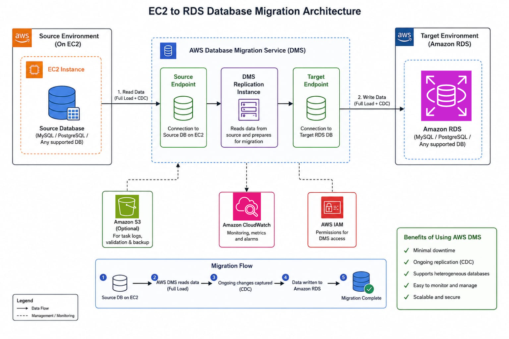
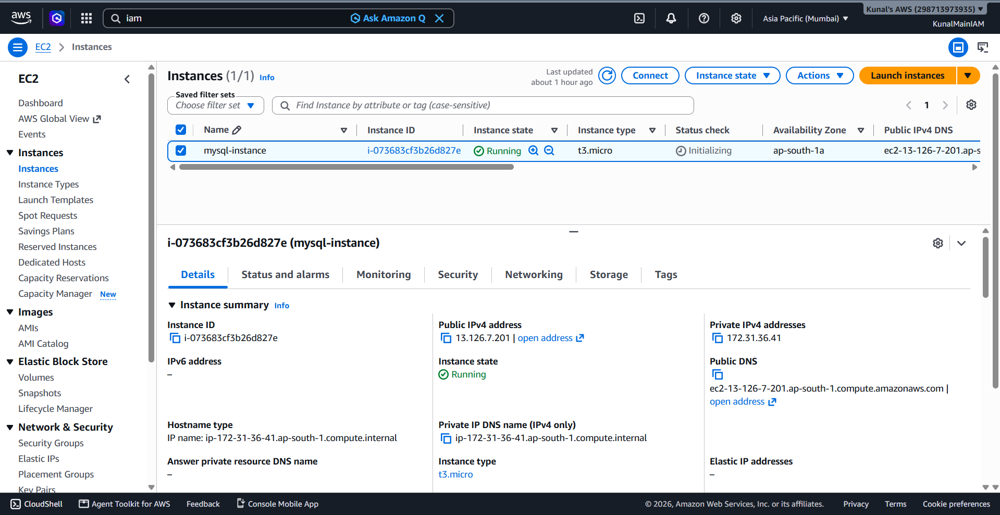
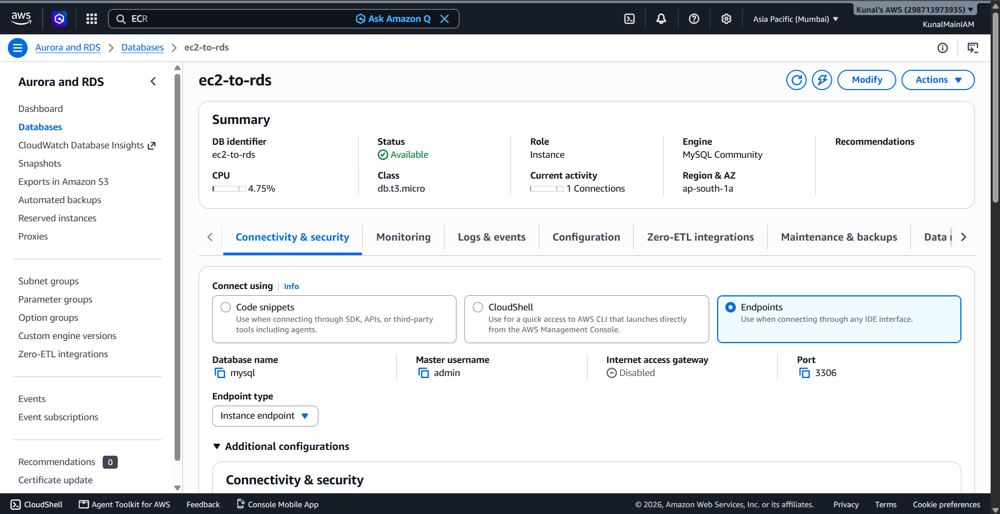
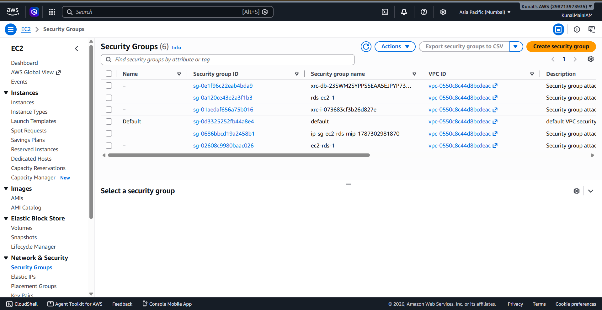
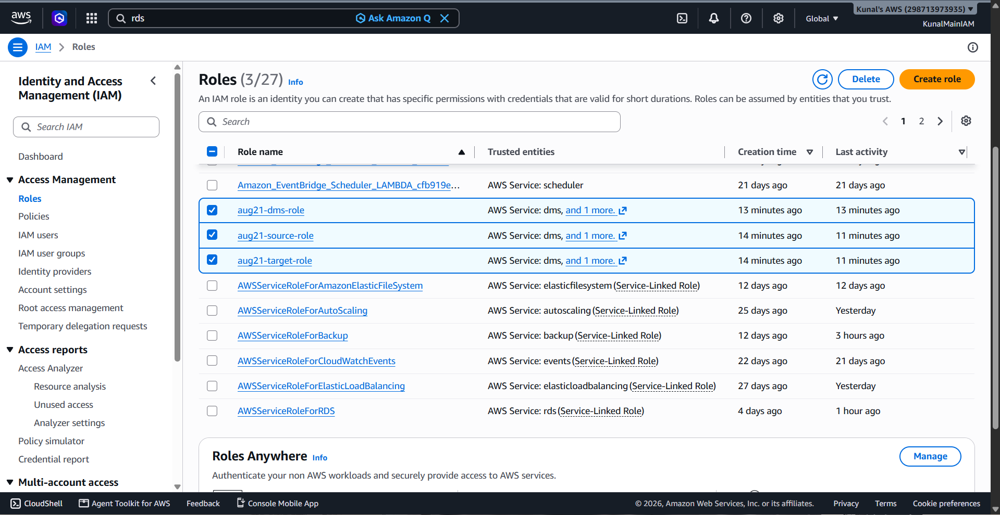
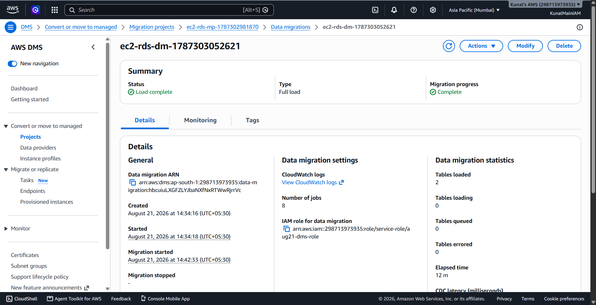
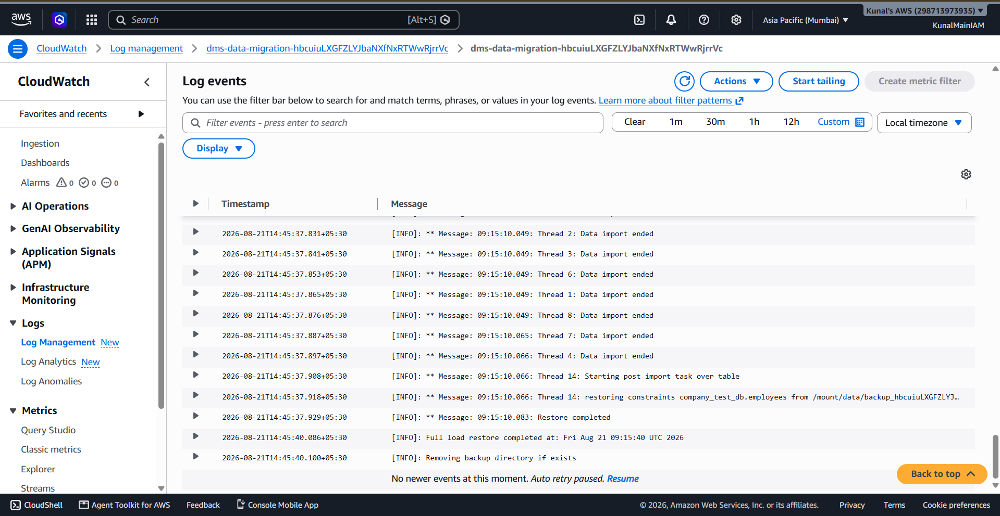
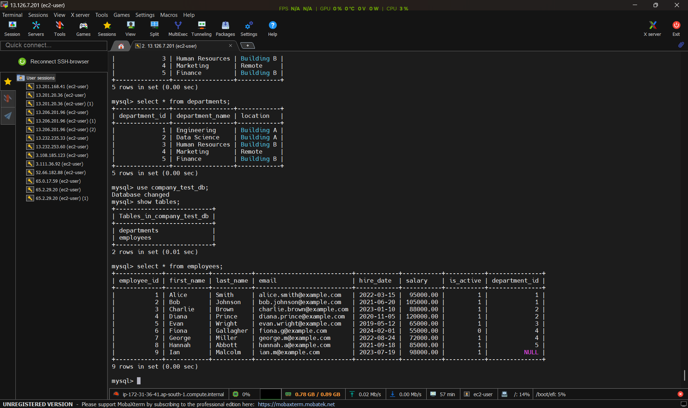

# 🚀 Zero-Downtime Database Migration from Amazon EC2 to Amazon RDS

[](https://aws.amazon.com/)
[](https://aws.amazon.com/ec2/)
[](https://aws.amazon.com/rds/)
[](https://aws.amazon.com/dms/)
[](https://www.mysql.com/)
[](LICENSE)

---

## 📌 Project Overview

In enterprise environments, hosting a relational database directly on a self-managed virtual machine (**Amazon EC2**) incurs significant operational overhead—requiring manual operating system patching, routine database maintenance, custom backup scripts, and manual disaster recovery failover setups.

This project demonstrates a production-grade, end-to-end migration of a live **MySQL database** from an **Amazon EC2 instance** to a fully managed **Amazon RDS (Relational Database Service) MySQL instance** using **AWS Database Migration Service (AWS DMS)** with minimal downtime and zero data loss.

---

## 🏗️ Architecture Overview

```
                          ┌──────────────────────────────────────┐
                          │               AWS VPC                │
                          │                                      │
   ┌───────────────────┐  │   ┌──────────────────────────────┐   │  ┌───────────────────┐
   │    Amazon EC2     │  │   │  AWS DMS Replication Engine  │   │  │    Amazon RDS     │
   │  (Source MySQL)   ├──┼──►│                              ├───┼─►│  (Target MySQL)   │
   │  Port 3306 (SG)   │  │   │ ┌──────────┐   ┌───────────┐ │   │  │  Port 3306 (SG)   │
   └───────────────────┘  │   │ │Source EP │──►│ Target EP │ │   │  └───────────────────┘
                          │   │ └──────────┘   └───────────┘ │   │
                          │   └──────────────▲───────────────┘   │
                          └──────────────────┼───────────────────┘
                                             │
                                   ┌─────────┴─────────┐
                                   │  AWS CloudWatch   │
                                   │  (Logs & Metrics) │
                                   └───────────────────┘
```

### 🖼️ High-Level Architecture Diagram


---

## 🎯 Key Objectives

1. **Eliminate Operational Overhead:** Transition database operations from self-managed EC2 infrastructure to fully managed Amazon RDS.
2. **Ensure Data Integrity & Consistency:** Use AWS DMS to migrate schemas, relational foreign keys, constraints, and data records accurately.
3. **Maintain High Security:** Isolate database endpoints within VPC private subnets, apply least-privilege IAM policies (`dms-vpc-role`), and enforce strict Security Group ingress/egress rules.
4. **Comprehensive Monitoring:** Enable AWS CloudWatch logs and DMS task statistics to track real-time migration status and throughput.

---

## 📂 Repository Structure

```text
migrate-database-ec2-to-rds/
├── architecture-diagram/
│   └── ec2-to-rds-database-migration.png    # End-to-end cloud migration architecture
├── screenshots/
│   ├── ec2-instance.png                     # EC2 source instance configuration
│   ├── rds-database.png                     # Amazon RDS target DB configuration
│   ├── security-group.png                   # Inbound/Outbound security group rules
│   ├── iam-role.png                         # IAM role configuration for AWS DMS
│   ├── dms-project.png                      # DMS task execution and replication status
│   ├── cloudwatch-logs.png                  # CloudWatch replication log streams
│   └── result.png                           # Post-migration query validation on RDS
├── scripts/
│   ├── mysql-install.txt                    # MySQL 8.4 installation & secure config script
│   ├── demo-table.sh                        # Sample relational schema & datasets
│   └── iam-role.txt                         # IAM pass-role policy definition for DMS
├── LICENSE                                  # MIT License
└── README.md                                # Project documentation
```

---

## 🛠️ Tech Stack & AWS Services

| Component | Technology / AWS Service | Role |
| :--- | :--- | :--- |
| **Compute / Source** | **Amazon EC2 (Amazon Linux 2023)** | Hosts the original source MySQL 8.4 database |
| **Target Database** | **Amazon RDS (MySQL Engine)** | Fully managed target database instance |
| **Migration Engine** | **AWS DMS (Database Migration Service)** | Handles live data replication between endpoints |
| **Security & IAM** | **AWS IAM & Security Groups** | Manages network access control and replication roles |
| **Observability** | **Amazon CloudWatch Logs** | Captures real-time migration task logs and task metrics |

---

## 🚀 Step-by-Step Implementation

### Phase 1: Source Database Setup on Amazon EC2

1. Launch an Amazon EC2 instance (Amazon Linux 2023 / t2.micro or t3.micro).
2. Connect to the EC2 instance via SSH/EC2 Instance Connect and install MySQL 8.4 Server:

   ```bash
   sudo yum update -y
   sudo dnf install mysql8.4-server -y
   sudo systemctl enable --now mysqld.service
   sudo systemctl status mysqld
   ```

3. Run security configuration:
   ```bash
   sudo mysql_secure_installation
   ```

4. Connect to MySQL and initialize the sample `company_test_db` database with relational tables (`departments`, `employees`):
   ```sql
   CREATE DATABASE IF NOT EXISTS company_test_db;
   USE company_test_db;

   CREATE TABLE departments (
       department_id INT AUTO_INCREMENT PRIMARY KEY,
       department_name VARCHAR(50) NOT NULL UNIQUE,
       location VARCHAR(50) DEFAULT 'Main Campus'
   );

   CREATE TABLE employees (
       employee_id INT AUTO_INCREMENT PRIMARY KEY,
       first_name VARCHAR(50) NOT NULL,
       last_name VARCHAR(50) NOT NULL,
       email VARCHAR(100) UNIQUE,
       hire_date DATE NOT NULL,
       salary DECIMAL(10, 2) NOT NULL,
       is_active BOOLEAN DEFAULT TRUE,
       department_id INT,
       FOREIGN KEY (department_id) REFERENCES departments(department_id) ON DELETE SET NULL
   );
   ```

*(See [scripts/demo-table.sh](scripts/demo-table.sh) for full schema and sample datasets)*

---

### Phase 2: Target Database Provisioning on Amazon RDS

1. Navigate to **Amazon RDS Console → Databases → Create Database**.
2. **Engine Type:** MySQL (Community Edition).
3. **Template:** Free Tier.
4. **Settings:**
   - DB Instance Identifier: `database-1` (or your preferred name)
   - Master Username: `admin`
   - Master Password: Set a secure password
5. **Connectivity:**
   - Associate with the same VPC as the EC2 instance.
   - Attach a dedicated Security Group allowing inbound MySQL traffic on port **3306**.

---

### Phase 3: Security & IAM Role Configuration

1. **Security Groups:**
   - **EC2 Security Group:** Allow inbound port `3306` from the DMS Replication Instance security group / VPC CIDR.
   - **RDS Security Group:** Allow inbound port `3306` from EC2 and the DMS Replication Instance.

2. **DMS IAM Role (`dms-vpc-role`):**
   - Create the inline policy to permit `iam:PassRole`:
   ```json
   {
     "Version": "2012-10-17",
     "Statement": [
       {
         "Effect": "Allow",
         "Action": "iam:PassRole",
         "Resource": "arn:aws:iam::*:role/dms-vpc-role"
       }
     ]
   }
   ```
*(See [scripts/iam-role.txt](scripts/iam-role.txt))*

---

### Phase 4: AWS Database Migration Service (DMS) Configuration

1. **Create Replication Instance:**
   - Go to **AWS DMS → Replication instances → Create replication instance**.
   - Instance class: `dms.t3.micro` or `dms.t3.small`.
   - VPC: Select the migration VPC.

2. **Create Endpoints:**
   - **Source Endpoint:**
     - Endpoint Type: Source database
     - Engine: MySQL
     - Server Name: Private IP / DNS of EC2 Instance
     - Port: `3306`
     - Username / Password: EC2 MySQL credentials
   - **Target Endpoint:**
     - Endpoint Type: Target database
     - Engine: MySQL
     - Server Name: RDS Endpoint URL
     - Port: `3306`
     - Username / Password: RDS Master credentials
   - Run **Test Connection** for both endpoints to ensure status is `successful`.

3. **Create & Run Database Migration Task:**
   - Task identifier: `ec2-to-rds-migration-task`
   - Migration type: **Migrate existing data** (Full load) or **Full load + CDC (Change Data Capture)**.
   - Table mappings: Include schema `company_test_db` with wildcard `%` tables.
   - Enable **CloudWatch Logs** for real-time task auditing.
   - Start the task and monitor progress until status transitions to **Load complete**.

---

### Phase 5: Verification & Post-Migration Validation

1. Connect to the target **Amazon RDS instance** using the MySQL client:
   ```bash
   mysql -h <rds-endpoint-url> -P 3306 -u admin -p
   ```

2. Validate database schemas, tables, and record counts:
   ```sql
   SHOW DATABASES;
   USE company_test_db;
   SHOW TABLES;

   -- Check employees record count
   SELECT COUNT(*) AS total_employees FROM employees;

   -- Execute analytical queries to confirm data relationships
   SELECT d.department_name,
          COUNT(e.employee_id) AS total_staff,
          ROUND(AVG(e.salary), 2) AS avg_salary
   FROM departments d
   LEFT JOIN employees e ON d.department_id = e.department_id
   GROUP BY d.department_name;
   ```

---

## 📸 Visual Verification & Proof of Work

### 1. EC2 Source Instance Running MySQL


### 2. Amazon RDS Target Database Created


### 3. Security Group & Network Access Control


### 4. IAM Role & Policy for AWS DMS


### 5. AWS DMS Task Execution (Load Complete)


### 6. CloudWatch Logs for DMS Replication Task


### 7. Post-Migration Query Results on Target RDS


---

## 🔒 Security Best Practices Implemented

- [x] **Network Isolation:** All database traffic contained within a dedicated Amazon VPC.
- [x] **Least Privilege Access:** Specific security group rules allowing port `3306` only between authorized source and target endpoints.
- [x] **Managed High Availability:** Leverages RDS automated backups, snapshot capabilities, and multi-AZ deployment readiness.
- [x] **Auditing & Logging:** End-to-end task audit trail streamed to Amazon CloudWatch.

---

## 🧹 Resource Cleanup

To avoid ongoing AWS charges after completing the migration lab:

1. **AWS DMS:** Delete Migration Tasks $\rightarrow$ Delete Endpoints $\rightarrow$ Delete Replication Instance.
2. **Amazon RDS:** Delete the RDS database instance (ensure "Create final snapshot" is unchecked if not required).
3. **Amazon EC2:** Terminate the EC2 MySQL host instance.
4. **Security Groups & IAM:** Remove unused security group rules and custom IAM roles.

---

## 👨‍💻 Author

**Kunal Jadhav**  
*Aspiring DevOps & Cloud Engineer*  

[](https://linkedin.com/in/devkunaljadhav)
[](https://github.com/devkunaljadhav)
[](mailto:kunaljadhav1625@gmail.com)
